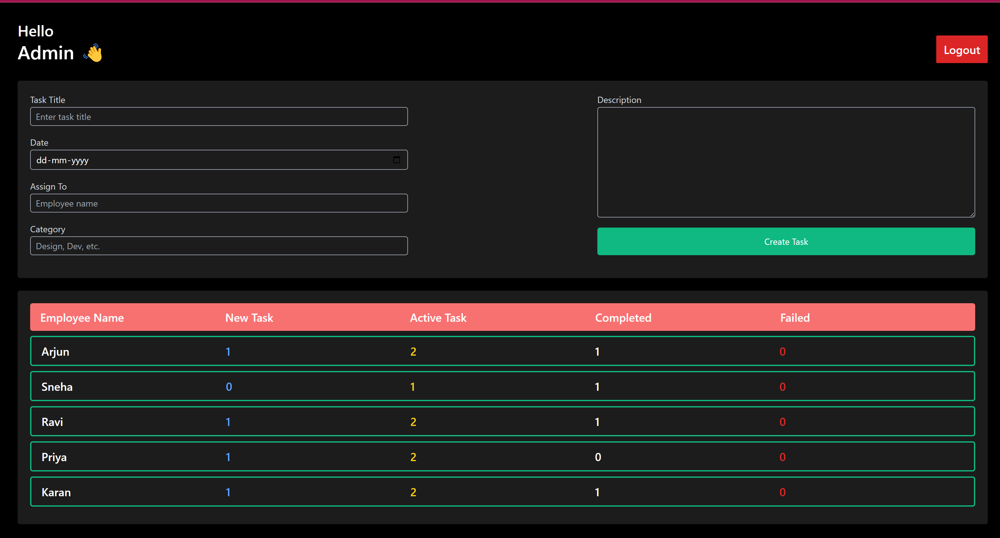

# Employee Management System (EMS)
The Employee Management System (EMS) is a basic project built with React that allows users to manage tasks and employees. It uses local storage for data management and focuses on creating, assigning, and tracking tasks.

# Features
Add, assign, and track employee tasks.
User-friendly interface for task management.
Uses local storage for persisting data.
# Technologies Used
React: For building the UI.
Tailwind CSS: For styling components.
# Limitations
The project is not responsive.
No backend integration; local storage is used for data storage.
Task data does not persist across multiple logins or page reloads unless managed properly in local storage.
# Setup and Installation
Clone the repository:
git clone <repository-link>
Navigate to the project directory:
cd employee-management-system
Install dependencies:
npm install
Start the development server:
npm start

# How to Use
1. Admin Login
To access the Admin Panel, use the following credentials:

Email: admin@example.com

Password: 123

2. User Login
To access the User Dashboard and view assigned tasks, use the following dummy user credentials:

Email: e@e.com

Password: 123

# Deployment
The project can be deployed using platforms like Vercel or Netlify. Ensure to resolve any path-related issues for smooth deployment.
link:https://ems-o8cz-shresthapandits-projects.vercel.app/

# Contributions
Contributions are welcome! Feel free to fork the repository and submit a pull request.

# License
This project is licensed under the MIT License.
